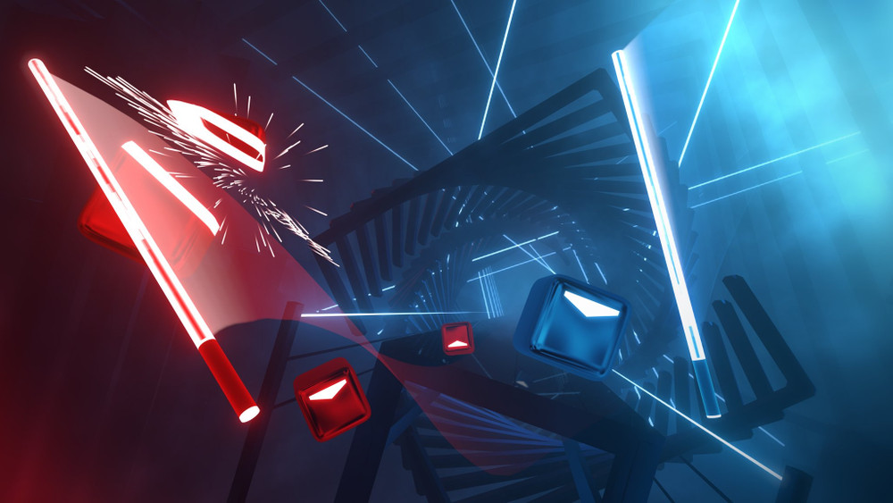
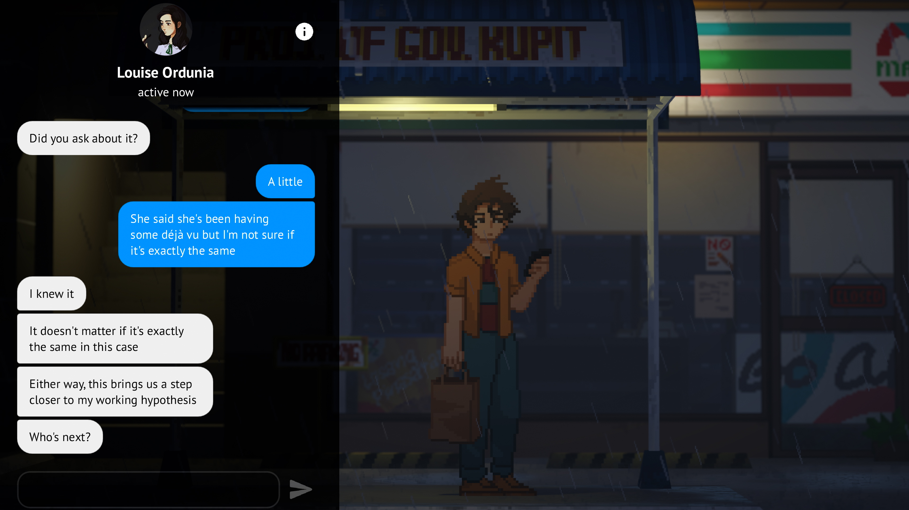

# PEC3_Manovich_Reloaded
Ensayo sobre hibridación para la asignatura de Cultura Digital

# PEC3: Manovich Reloaded
**Autor:** Pablo Martínez Rosa  
**Fecha:** 11/05/2026  
**Licencia:** Creative Commons Attribution-ShareAlike 4.0 International (CC BY-SA 4.0)

---

## Introducción
Este ensayo analiza la evolución de la hibridación siguiendo las tesis de Lev Manovich en El software toma el mando. A diferencia de la multimedia, la hibridación se da cuando los lenguajes de diferentes medios se fusionan a través del software para generar nuevas formas de interacción.

Para dar a entender este concepto, se estudiaran los siguientes dos casos contemporáneos: Beat Saber y Until Then. Estos dos demuestran cómo el software redefine la música, el espacio y la narrativa social. El uso de GitHub para este ensayo responde a la filosofía de cultura abierta y a la colaboración en los entornos digitales.

---

## Caso 1: Beat Saber – Un juego de ritmo encajado en un entorno de realidad virtual

**Beat Saber** representa uno de los ejemplos más puros de lo que Lev Manovich denomina "hibridación" en su obra fundamental *El software toma el mando*. A diferencia de la multimedia de finales del siglo XX, donde simplemente coexistían en zonas paralelas los distintos elementos que componen la multimedia, en este videojuego el software actúa como un motor de fusión que mezcla la naturaleza de ambos medios. En este videojuego, no estamos simplemente ante un programa que reproduce una pista musical mientras muestra imágenes estáticas, sino que estamos ante un ecosistema de software que convierte el sonido en una arquitectura geométrica realista y navegable virtualmente en estas tres dimensiones. Esta capacidad de transformar el sonido en lo espacial (geometría) es la esencia de la hibridación mediática contemporánea.

Bajo las "gafas de Manovich", podemos ver que *Beat Saber* realiza una **remediación** radical de los reproductores de audio tradicionales. Mientras que en un software analógico o en un reproductor digital clásico la música se puede ver de forma bidimensional mediante una onda sonora o una barra de progreso, aquí el software hace que la música se mezcle con el diseño de videojuegos y la arquitectura virtual. El ritmo se transforma por completo en objetos físicos que tienen propiedades de profundidad, altura, color y dirección. Todo esto no solo permite que el usuario no solo escuche la obra sonora, sino que la pueda sentir mediante movimientos y que la pueda ver desde el horizonte virtual atravesando los bloques físicamente sincronizandose todo el tiempo con el ritmo de la música. El software elimina de forma efectiva la distinción histórica entre el medio sonoro y el espacio tridimensional, creando un híbrido único donde el jugador se ubica dentro de la propia partitura.

Otro punto clave en este análisis es la hibridación de la coreografía con el procesamiento de datos a alta velocidad. El jugador está equipado con visores de Realidad Virtual y mandos que controlan el movimiento de sus brazos, este jugador deja de ser un espectador y se convertirse en parte de la interfaz. Según Manovich, el software permite que diferentes lenguajes culturales que antes estaban separados se fusionen de forma inseparable; en este caso, se hibrida la danza y el movimiento corporal con la precisión matemática del código. Cada movimiento de los brazos del jugador es una entrada de datos que el software procesa en milisegundos para validar la interacción con la música. Esta interfaz tan profunda hace que el cuerpo humano funcione como un "mando" más del sistema, integrando la respuesta física en el propio juego, eliminando la frontera entre la persona y el producto tecnológico.

Finalmente, el éxito masivo y la relevancia cultural de *Beat Saber* se compone en su capacidad de mezclar distintos conceptos. Gracias a que el juego funciona sobre una arquitectura de software que permite la apertura a la comunidad de usuarios, estos pueden utilizar herramientas externas para crear sus propios "mapas" o coreografías de canciones. Todo esto demuestra perfectamente la teoría de Manovich sobre cómo el software empodera al usuario final para romper con la jerarquía tradicional, convirtiendo el consumo cultural en producción masiva. El resultado final es un videojuego, pero también es un ecosistema híbrido en constante expansión donde la música pop, la programación informática y la expresión corporal convergen en una nueva forma de arte digital y metamedio que sería absolutamente imposible de concebir fuera del ecosistema del software.

---

---

## Caso 2: Until Then – La vida como interfaz de datos

**Until Then** es un caso fascinante de hibridación moderna que explora cómo el software ha "tomado el mando" de nuestra vida social y emocional, transformando la experiencia del usuario en un proceso de interacción técnica y narrativa. El juego se aleja decididamente de la narrativa cinematográfica tradicional para abrazar lo que podríamos llamar una "narrativa de interfaz". En lugar de limitarse a mostrar escenas pasivas, el software hibrida la estructura literaria de una novela visual con la simulación profunda de sistemas operativos y redes sociales contemporáneas. Según las tesis de Manovich, la hibridación ocurre cuando las propiedades físicas y lógicas de un medio se incorporan a otro, creando un objeto cultural nuevo. En este título, la navegación por una interfaz simulada —realizar *scroll* infinito, dar *likes*, gestionar notificaciones o chatear mediante teclados virtuales— se convierte en el lenguaje principal y el motor de avance para contar una compleja historia de pérdida y amistad. No es solo un juego sobre redes sociales; es un juego que ocurre "dentro" de la lógica del software social.

Un aspecto innovador y profundamente híbrido es cómo el software toma la lógica de los videojuegos de ritmo y la aplica a tareas mundanas de la vida real. En la existencia analógica, realizar una tarea escolar, comer en un puesto callejero o interactuar con un objeto son acciones continuas y fluidas. Sin embargo, en *Until Then*, estas acciones se hibridan con la estética del software de precisión y el *input* cuantificado. Al convertir la inserción de un dispositivo USB o el ritmo de una conversación en un minijuego de coordinación rítmica, el software está, de manera literal, "digitalizando" la experiencia humana subjetiva. Manovich sostiene que el software redefine nuestras categorías culturales y cognitivas; en este juego, la "cotidianeidad" se redefine como una serie de comandos rítmicos que el usuario debe ejecutar con exactitud algorítmica. Esta hibridación entre lo banal y lo mecánico subraya cómo el software ha moldeado nuestra percepción moderna del tiempo, el rendimiento y la productividad personal.

Visualmente, *Until Then* se posiciona como un híbrido perfecto entre el pasado y el futuro de la imagen digital. Utiliza el *pixel art*, un lenguaje visual que nació originalmente de las limitaciones técnicas de la computación de los años 80, pero lo somete a procesos de software contemporáneos de una complejidad inalcanzable en la era analógica: iluminación dinámica, desenfoque de profundidad (*bokeh*), efectos de partículas y un post-procesamiento de video de alta gama. Esto crea lo que Manovich define como un "nuevo metalenguaje visual" o "metamedios". No se trata de un simple retorno nostálgico al pasado, sino de una hibridación donde la estética de baja resolución se encuentra con una potencia de cálculo masiva. El resultado es una imagen atmosférica que parece una pintura en movimiento, donde cada píxel está influenciado por algoritmos de luz y sombra que imitan la cinematografía moderna.

Por último, el juego integra de forma magistral la tensión entre el concepto de base de datos y la narrativa. Manovich argumenta que la era del software favorece la estructura de base de datos, mientras que la cultura tradicional prefiere la narrativa lineal. *Until Then* hibrida ambas lógicas con maestría: para avanzar en el hilo conductor de la historia, el jugador se ve obligado a explorar bases de datos de fotografías, revisar perfiles de redes sociales y navegar por muros de noticias antiguos. La narrativa ya no es una línea recta predefinida, sino que emerge de la interacción constante del usuario con un entorno de software simulado que organiza la información. Es el ejemplo perfecto de cómo el software no solo sirve para "ver" un contenido cultural, sino para "gestionar" y filtrar la experiencia de una historia a través de sus propias herramientas de organización de datos, convirtiendo al jugador en un usuario activo de la información.

---

## Conclusiones

Después de haber analizado tanto Beat Saber como Until Then usando las ideas de Lev Manovich, queda claro que el software no es solo un sitio donde se guardan cosas, sino que es el motor que cambia la cultura y nuestra forma de entender los medios de siempre.

Con Beat Saber, hemos podido ver cómo el software es capaz de romper con la idea de que la música es algo lineal para convertirla en una experiencia que se puede tocar y navegar. Aquí la hibridación real está en mezclar el ritmo con la arquitectura en tres dimensiones y el movimiento de nuestro cuerpo, creando una forma de arte que sería imposible de imaginar fuera de la Realidad Virtual.

Por otra parte, el caso de Until Then nos enseña que la hibridación también llega a lo narrativo y a lo social. Al meter la interfaz de las redes sociales y las mecánicas de ritmo en las tareas más normales de los personajes, el software consigue "remediar" lo que era la novela visual de toda la vida, convirtiéndola en algo que funciona como un espejo de cómo vivimos hoy en día, siempre pegados a una pantalla.

Para terminar, estos ejemplos nos sirven para confirmar lo que decía Manovich: el software de verdad ha "tomado el mando" y nos ha dejado crear metamedios. Estos ya no son simplemente música, imagen y código por separado, sino una forma nueva de expresión donde ya no está tan claro dónde termina el autor, dónde empieza el usuario o qué parte es la interfaz. Este mismo proyecto, que está subido en un repositorio abierto de GitHub, es un ejemplo de esa cultura del software: una pieza pensada para ser compartida, usada por otros y entendida como un granito de arena más en este ecosistema digital en el que vivimos.

---

## Recursos y Bibliografía

* **Manovich, L. (2013).** *El software toma el mando*. Barcelona: Editorial UOC.
* **Beat Games (2018).** *Beat Saber* [Videojuego]. Disponible en: https://www.beatsaber.com/
* **Polychroma Games (2024).** *Until Then* [Videojuego]. Disponible en: https://untilthengame.com/
* **Adell, Ferran.** *Fundamentos de la hibridación según Lev Manovich*. Material didáctico UOC.
* **Markdown Guide.** *Getting Started with Markdown*. Recuperado de: https://www.markdownguide.org/getting-started/
* **Creative Commons.** *About CC Licenses*. Recuperado de: https://creativecommons.org/about/cclicenses/
* **Instant Gaming.** *Beat Saber y su contenido adicional*. Imagen recuperada de: https://news.instant-gaming.com/es/articulos/13256-beat-saber-no-tendra-mas-contenido-adicional-para-playstation-vr-1-y-2-a-partir-de-este-mes
* **Until Then Official.** *Until Then Gameplay and World*. Imagen recuperada de: https://untilthengame.com/
